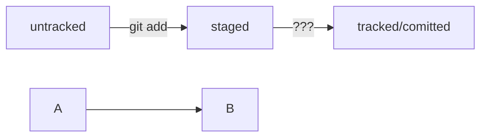
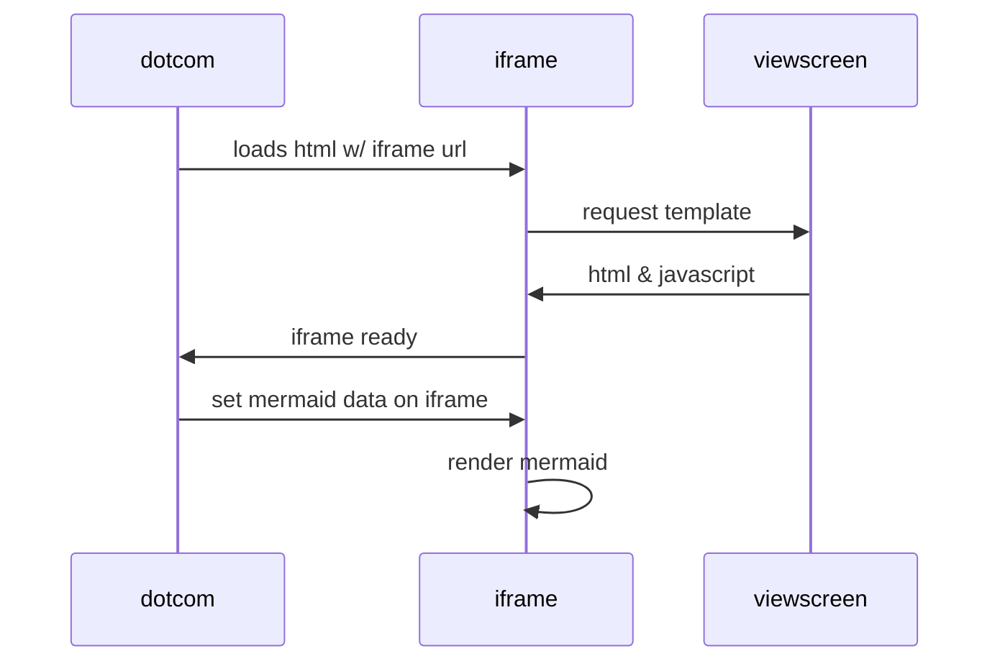
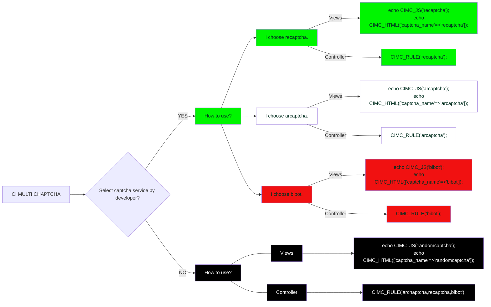

# Практика

## Краткое описание порядка действий, команды для репозитория

1. Создадим папку с проектом на локальном компьютере.```mkdir my_project```
2. Перейдем в созданную папку.```cd my_project```
3. Инициализируем git.```git init```
4. Зададим глобальные параметры.```git config --global user.name "Maksim Monakhov"```
5. Создадим файл.```touch README.md```
6. Поместим в "корзину".```git add --all```
7. Синхронизируемся с гитом.```git remote add origin git@github.com:MaksimMonakhov/practic_1.git```
8. Коммитим.```git commit -m 'Практика 1'```
8. Пушим.```git push -u origin master```
   Далее```git push```

Далее возможно просто изменять файл и...
```
git add --all
git commit -m 'Изменения'
git push
```

## Вставляем mermaid

### Простой mermaid



### Сложнее





## Сделать шаг назад, если что-то пошло не так

- Команда ```git restore --staged <file>``` переведёт файл из staged обратно в modified или untracked. Эта команда уберёт файл из списка на коммит, и он вернётся в состояние  untracked.
- Команда ```git reset --hard <commit hash>``` «откатит» историю до коммита с хешем <hash>. Более поздние коммиты потеряются!
- Команда ```git restore <file>``` «откатит» изменения в файле до последней сохранённой (в коммите или в staging) версии.

## Просмотр изменений в файлах

После коммита внесли изменения в файл, посмотреть изменения - ```git diff```
После ```git add``` посмотреть изменения - ```git diff --staged```